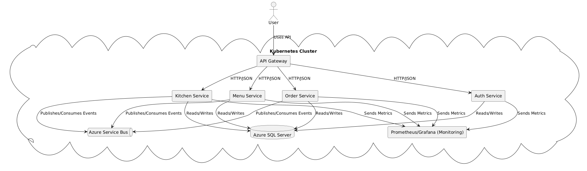

# FastTech Foods - Microservices Architecture

Este repositório contém a definição da arquitetura DDD para a plataforma de atendimento e pedidos do Hackaton FastTech Foods.

## Descrição do Projeto

A solução adota uma arquitetura baseada em microsserviços, orquestrada em um cluster Kubernetes, com comunicação síncrona via HTTP/JSON e assíncrona via Azure Service Bus. Todos os dados são persistidos em um único banco de dados Azure SQL Server. O monitoramento é realizado com Prometheus e Grafana.

### Serviços

- **API Gateway**: Ponto de entrada para todas as requisições do usuário.  (Esse serviço nao foi desenvolvido)
- **Auth Service**: Autenticação e autorização.  
- **Order Service**: Gerencia criação e consulta de pedidos.  
- **Menu Service**: Responsável por CRUD de itens do cardápio.  
- **Kitchen Service**: Orquestra fluxo de preparo na cozinha.  

### Infraestrutura

- **Kubernetes Cluster (Azure)**: Deploy de todos os microsserviços e componentes.  
- **Azure Service Bus**: Mensageria para eventos entre serviços.  
- **Azure SQL Server**: Banco de dados relacional único para todos os serviços.  
- **Prometheus & Grafana**: Coleta e visualização de métricas.  

## Diagrama de Arquitetura

